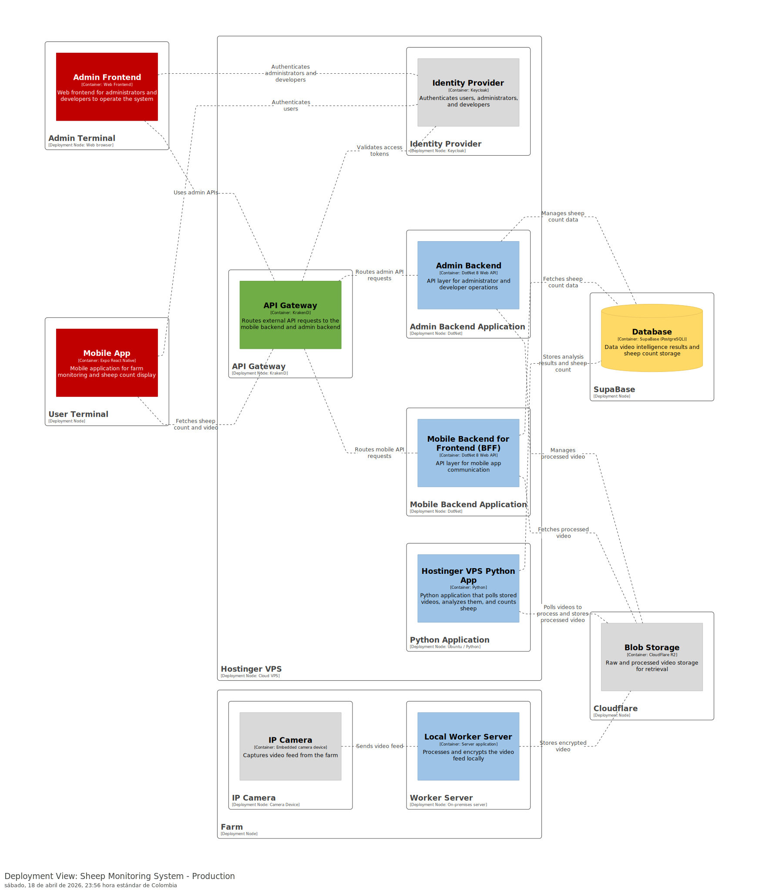
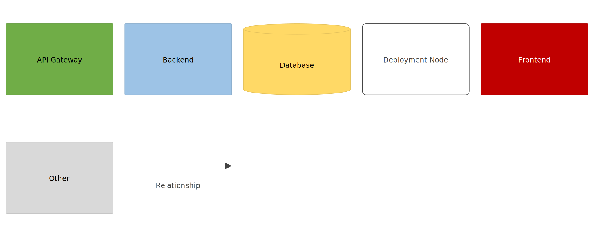
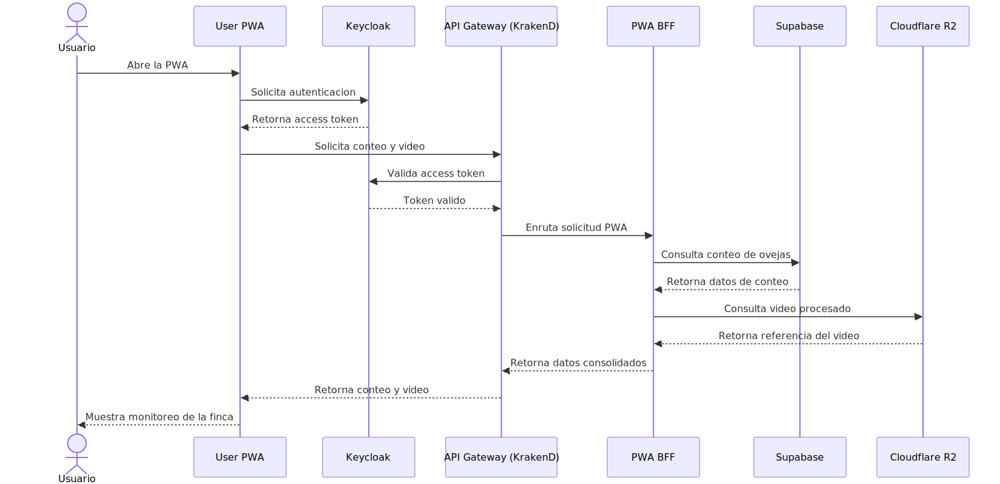
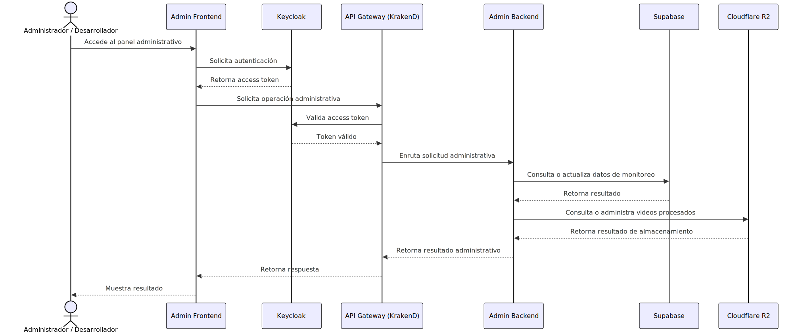
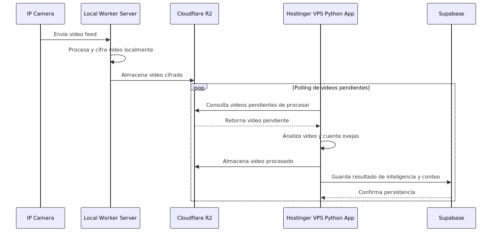

# Proyecto: Sistema de monitoreo de ovejas

Sistema para monitorear una granja, recolectar video de las ovejas, procesarlo para contar el número de ovejas, detectar enfermedades y celos, además alertar sobre robos y depredadores.

## Sitio web

[www.ganadotech.com](https://www.ganadotech.com)

## Diagrama de despliegue

## Diagramas de secuencia

### Flujo de usuario final

### Flujo de administrador

### Flujo de recolección y procesamiento de videos

