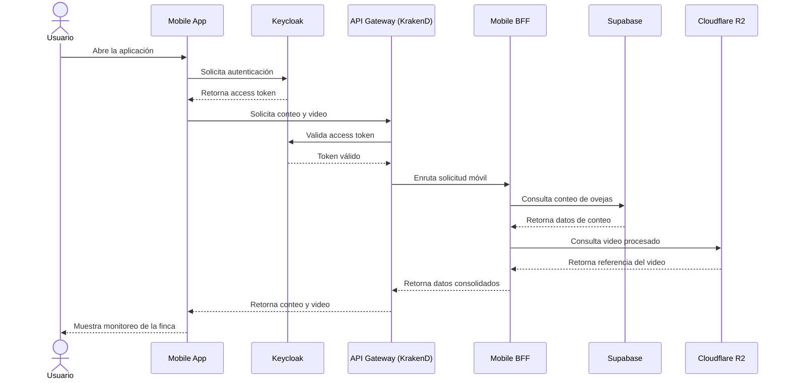

```mermaid
sequenceDiagram
    actor User as Usuario
    participant Mobile as Mobile App
    participant Keycloak as Keycloak
    participant Gateway as API Gateway (KrakenD)
    participant MobileBff as Mobile BFF
    participant Supabase as Supabase
    participant R2 as Cloudflare R2

    User->>Mobile: Abre la aplicación
    Mobile->>Keycloak: Solicita autenticación
    Keycloak-->>Mobile: Retorna access token
    Mobile->>Gateway: Solicita conteo y video
    Gateway->>Keycloak: Valida access token
    Keycloak-->>Gateway: Token válido
    Gateway->>MobileBff: Enruta solicitud móvil
    MobileBff->>Supabase: Consulta conteo de ovejas
    Supabase-->>MobileBff: Retorna datos de conteo
    MobileBff->>R2: Consulta video procesado
    R2-->>MobileBff: Retorna referencia del video
    MobileBff-->>Gateway: Retorna datos consolidados
    Gateway-->>Mobile: Retorna conteo y video
    Mobile-->>User: Muestra monitoreo de la finca
```